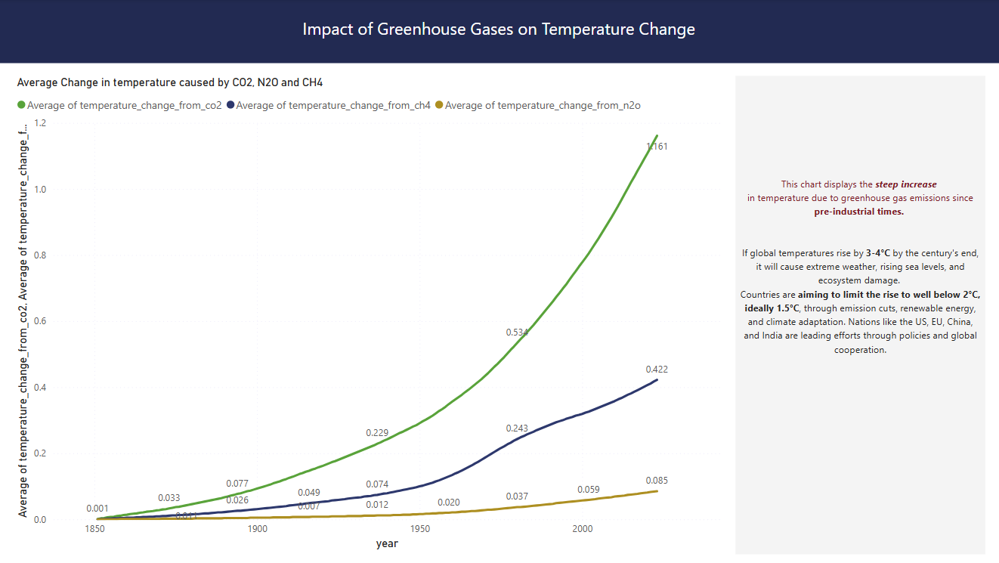

# Global Greenhouse Gas (GHG) & CO₂ Emissions Data Pipeline 🌍 

## Table of Contents

- [Overview](#overview)
- [Problem Statement](#problem-statement-the-climate-challenge)
    - [Key Research Questions](#key-research-questions)
- [Objectives](#objectives)
- [Data Source](#data-source)
    - [Citation](#citation)
- [Tech Stack](#tech-stack)
- [Data Pipeline Architecture Diagram](#pipeline-architecture)
- [Pipeline Overview](#pipeline-overview)
- [DBT Lineage Graph](#dbt-lineage-view)
- [Dashboard](#dashboard)
- [Instructions to Reproduce](#instructions-to-reproduce)
- [Future Improvements](#future-improvements)
- [Acknowledgment](#acknowledgement)

## Overview

Climate change is one of the most pressing global challenges, with greenhouse gas (GHG) emissions—especially carbon dioxide (CO₂)—being a major driver of rising global temperatures. Understanding emission trends is critical for policymakers, researchers, and sustainability leaders aiming to mitigate climate change and develop effective carbon reduction strategies.

## Problem Statement: The Climate Challenge

Greenhouse gases (GHGs), especially carbon dioxide (CO₂), are major contributors to climate change. Human activities like fossil fuel combustion, deforestation, and agriculture have significantly increased CO₂ emissions, driving global warming and its associated impacts. These include:

- **Rising Global Temperatures**: A 1.1°C increase since pre-industrial times, with potential catastrophic effects.
- **Extreme Weather Events**: Intensified hurricanes, floods, and droughts affecting vulnerable regions.
- **Health Risks**: Air pollution causing respiratory and cardiovascular diseases.
- **Economic & Social Disruptions**: Costing billions globally, with developing nations most affected.

### Key Research Questions

- How have global CO₂ emissions changed over time?
- Which countries and regions contribute the most to emissions?
- What sectors and sources drive emissions the most?
- How do per-capita emissions compare across countries?

## Objectives

This project aims to automate the ingestion, processing, and analysis of CO₂ & GHG emissions data to provide actionable insights for climate action, by examining trends in global CO₂ emissions over time to understand the scale and direction of the issue and identifying some key contributors to CO₂ emissions, such as countries and industries, and assess their roles in climate change.

- Automate data ingestion of global emissions dataset using Kestra.
- Process large-scale datasets efficiently with PySpark and Dataproc.
- Store structured data in Google Cloud Storage (GCS) and BigQuery for analytics.
- Transform raw data into insightful models using DBT.
- Enable interactive visualizations with Power BI.

## Data Source

This project uses the  CO2 and Greenhouse Gas Emissions dataset provided by [Our World in Data](https://github.com/owid/co2-data). You can find out more about the dataset and related metadata from the [codebook](https://github.com/owid/co2-data/blob/master/owid-co2-codebook.csv) provided. It includes a description and source for each indicator in the dataset.

Special thanks to them for making this valuable data publicly available. You can explore more such dataset on their [website](https://ourworldindata.org/). 

#### Citation
Hannah Ritchie, Pablo Rosado and Max Roser (2023) - “CO₂ and Greenhouse Gas Emissions” Published online at OurWorldinData.org. Retrieved from: ['https://ourworldindata.org/co2-and-greenhouse-gas-emissions'](https://ourworldindata.org/co2-and-greenhouse-gas-emissions) [Online Resource]

## Tech Stack 

 

 

## Pipeline Architecture Diagram

## Pipeline Overview

This is an overview of how the end-to-end analytics pipeline processes and analyzes Greenhouse Gas (GHG) emissions data using **Terraform**, **Kestra**, **PySpark**, **dbt**, and **Google Cloud Platform (GCP)**.

### Flow Summary

### Flow Summary

1. **Infrastructure Provisioning with Terraform**  
   - GCP resources including the **Cloud Storage bucket** (`ghg-bucket`), **Dataproc cluster** (`ghg-dataproc`), and **BigQuery datasets** (`Staging` and `Analytics`) are provisioned using **Terraform**.

2. **Data Upload (via Kestra)**  
   - Raw GHG emissions data is sourced from the [OWID data repository](https://github.com/owid/co2-data) and uploaded to the **GCS bucket** for processing.

3. **Processing with PySpark (via Kestra + Dataproc)**  
   - The L**PySpark** transformation script [transform_ghg_data.py](./scripts/transform_ghg_data.py) is uploaded to the **GCS bucket**.  
   - A **Dataproc job** is triggered to run the script, which defines the schema, cleans the data, and performs transformations.  
   - The processed data is then written to the **BigQuery `Staging` dataset**.

4. **Data Modeling with dbt**  
   - **dbt** models transform the staging data into analytics-ready tables in the **BigQuery `Analytics` dataset**.

5. **Visualization**  
   - A **Power BI dashboard** connects to the **BigQuery `Analytics` dataset** to enable interactive reporting and exploration of emissions trends, temperature changes, and economic correlations.

### What Kestra Does

Kestra orchestrates and automates the entire pipeline:

- **Configuration** (`gcp_kv.yml`):  
  Sets up GCP environment variables, service credentials, and resource references (GCS bucket, Dataproc cluster, BigQuery datasets).

- **Data Ingestion** (`gcp_upload.yml`):  
  Uploads raw emissions data into the GCS bucket.

- **Data Processing** (`gcp_spark_bq.yml`):  
  Submits a PySpark job to **Dataproc** to transform raw data and load the output into **BigQuery Staging**.

### What dbt Does

dbt manages the transformation of cleaned data in BigQuery:

- **Staging Models**  
  - `stg_emissions.sql`: Selects relevant fields, calculates emissions per capita.  
  - `stg_country.sql`: Extracts the latest GDP and population per country.

- **Core Models**  
  - `fact_emissions.sql`: Creates a partitioned and clustered emissions fact table.  
  - `dim_country_info.sql`: Builds a dimension table with country-level info.  
  - `annual_emissions.sql`: Aggregates total and per capita emissions by year.  
  - `global_temp.sql`: Analyzes temperature trends linked to emissions.  
  - `emissions_vs_econ.sql`: Compares GDP to CO₂ per capita emissions.

Final outputs from dbt are stored in the **Analytics** dataset and used in Power BI dashboards.

## DBT Lineage View 

This Lineage Graph represents the DAG, showing the flow of data between dbt models.. 

## Dashboard 

A high-level snapshot of total greenhouse gas (GHG) emissions, CO₂ emissions, and their impact on global temperature trends over time.

A geographic breakdown of emissions, showing region-wise contributions, emission per capita, and regional growth trends over the years.

A source-wise breakdown of major contributors to CO2 emissions and an examination of emissions in relation to economic growth.

An analysis of temperature change due to Greenhouse gas emissions since pre-industrial times. 

You can view a preview of this dashboard in my novypro account, [here](https://project.novypro.com/oRqeXa).

## Instructions to Reproduce

Steps to reproduce this end-to-end pipeline has been documented in [setup.md](./setup/setup.md). 

## Future Improvements

- Implement CI/CD
- Add Make file

## Acknowledgement

This is a capstone project developed as a part of **Data Engineering ZoomCamp** course. 

A huge thanks to the [DataTalks.Club](https://github.com/DataTalksClub) team and instructors for a great learning experience!