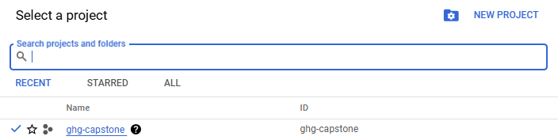
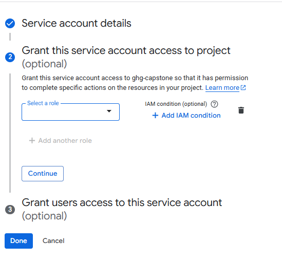
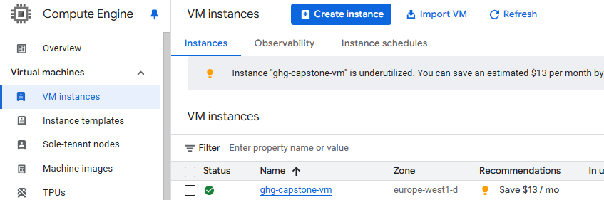

## Table of Contents

- [Setup Google Cloud Environment and SSH Key (Local)](#setup-google-cloud-environment-and-ssh-access-locally)
- [Setup Google Credentials and Github Project (VM)](#setup-google-credentials-and-github-project-vm)
- [Install Applications (VM)](#install-applications-vm)
- [Provision Infratructure using Terraform (VM)](#provision-infrastructure-using-terraform-vm)
- [Run Data Orchestration Pipeline using Kestra (VM)](#run-orchestration-pipeline-using-kestra-vm)
- [Build DBT models to prepare data for analytics (VM)](#build-dbt-transformation-models-in-the-vm)

### Setup Google Cloud Environment and SSH access (Locally)

1. Create an account on Google's Cloud platform with your Google email ID. 

2. Create a project in [Google Cloud Console](https://console.cloud.google.com/) and name it - `ghg-capstone`. Edit the custom `Project ID` and rename it as `ghg-capstone` as well.   

    

 > Note: You can choose to name the project as you wish, but ensure that environment and other project variables are set accrodingly. As per the chosen project_id, `modify .env`, `variables.tf`, and the `kestra flow GCP_KV`.

3. Install [Google Cloud SDK](https://cloud.google.com/sdk/docs/install) if it's not already installed in your system.

4. Go to `IAM & Admin > Service Accounts` and create a service account. Name the service account as `ghg-user` and give it the below mentioned permissions:

     

    here, 

    

    Click on `Done` after assigning the roles. The service Account will now be created. 

5. Click on the three dots under `Actions` for the created Service Account and select `Manage keys`.

    1. `Add key -> Create new key -> JSON -> Create`
    2. `Create New Key for this account (json)`

    Download created service-account-key, rename it as `ghg-creds.json` and put it in `~/.gc` dir (create folder if needed). 

    **Remember to the name the credential file as specified and save it within the same directory (preferably your user/home dir)**

6. Generate an SSH key (if you don't have it yet) by following the instructions below, and add it to GCP. We'll do this in order to login to VM instances.

    - In terminal (git bash):

        ```bash
        cd ~/.ssh
        ssh-keygen -t rsa -f ~/.ssh/gcp -C <username>
        ```
        This will generate an ssh keypair, named `gcp`. 
        **Remember to change the `username` specified in the command above accordingly.** 

    - Copy the generated public key to google cloud: `Compute Engine -> Settings -> Metadata -> SSH Keys -> Add ssh key` and copy all from file `gcp.pub`. If you already have SSH key to work with your GCP, you can reuse it.

7. Enable the below API's. 

    - Compute engine API
    - BigQuery API
    - IAM API
    - Dataproc API
    - Cloud Dataproc API
    - Service Networking API. 

8. Go to Compute Engine, and click on `Create a VM instance` to create a Virtual Machine Instance with the below specifications:

    

    - Machine Configs: 
        - instance name: `ghg-capstone-vm`
        - region: `europe-west1 (belgium)` 
        - machine type: `e2-standard-4 (4 vCPU, 2 core, 16 GB memory)`
    - OS & Storage:
        - OS: `Ubuntu`
        - version: `Ubuntu 20.04 LTS`
        - size: `30GB`
    - Identity & API access:
        - select `scope`-`allow default access` and `firewall`-`allow https traffic`

    
    - After the VM is created, copy the `External IP` address. 

    **Remember to modify the region as per your location/where the account is being created**

    > Note: You can choose to name the VM as you wish, but ensure that environment and other project variables are set accrodingly. As per the chosen VM name, modify `.env`.

7. Go to ~/.ssh in your local and modify, or update the `config` file if you already have it setup, to add a new Host `ghg-capstone-vm`, like this - 

    ```
        Host ghg-capstone-vm 
            HostName <external-ip>
            User <username> 
            IdentityFile ~/.ssh/gcp
    ```

    - Paste the copied VM External IP address here, and set the user as per the `username` entered in `Step 6` while creating the SSH key.
    - Now, you can connect to your VM by running `ssh ghg-capstone-vm`.  


8. Create a firewall rule to allow access to `Kestra UI` at port 8080. 

    

    Click on `Create`.


### Setup Google Credentials and Github Project (VM)

9. Add the service account keys created in `Step 5` to the VM. (It's convenient to make sure your json file is saved in a Home dir location.) You can follow any of the methods below. 

    - Method 1: 

        - In your gitbash terminal, cd to `.gc` directory where you've saved your `ghg-creds.json` file. (If it's saved in user or home dir, cd to that location).
        - Then, 
            - Run `sftp ghg-capstone-vm`
            - `mkdir .gc`
            - `cd .gc`
            - Run `put ghg-creds.json` 

    - Method 2: 

        - Run `scp ~/.gc/ghg-creds.json <username>@ghg-capstone-vm:~/.gc/`

            ```bash
            $ scp ~/.gc/ghg-creds.json <username>@ghg-capstone-vm:~/.gc/
            ghg-creds.json                                                                            100% 2346    72.6KB/s   00:00
            ```

10. Connect to your VM by running `ssh ghg-capstone-vm` in gitbash/ or click on `CTRL + SHIFT + P` and select `Remote-SSH` in VScode (To do this, install the `Remote-SSH` extension in VScode). 

11. In the VM, clone this repo and cd to it. 

    ```
    git clone https://github.com/Rimsha-Bashir/GHG-Emissions-Analytics-Pipeline.git 
    cd "GHG-Emissions-Analytics-Pipeline"
    ```

12. Run `pip install -r requirements.txt` to install necessary libraries and packages.


### Install Applications (VM)

12. Update the below variables in the `.env` file according to your project specifications (if you've chosen to set different values for the VM name, and GCP Project ID). If you choose to keep the same variable values as the project to avoid confusion, let the environment variables be as is. But **remember to update the PROJECT_LOCATION as it is specific to where your account is created**

    ```

    PROJECT_ID="ghg-capstone"
    VM_NAME="ghg-capstone-vm"
    PROJECT_LOCATION="europe-west1"
    KEY_FILENAME="ghg-creds.json"
    KEY_PATH="$HOME/.gc/${KEY_FILENAME}"

    ```

13. cd to the `setup` folder in the repo.  

14. Run the below commands

    ```bash

    chmod +x setup.sh 
    ./setup.sh

    ```

    This script will perform the below tasks:

    - Install Anaconda
    - Install Docker and Docker Compose (To run without sudo)
    - Install Spark and its dependencies
    - Install Terraform 
    - Activate and authenticate Google Application Credentials 
    - Set environment paths necessary is `.bashrc`

15. **!! Logout of the VM so your group membership for Docker is re-evaluated !!**

    ```bash
    logout ghg-capstone
    ```

### Provision Infrastructure using Terraform (VM) 

16. Update terraform variables in `~/.env` file. **Ensure that the values corresponding to TF_VAR_project, TF_VAR_region, and TF_VAR_location are correctly set as per your VM configurations!**

```
TF_VAR_project="ghg-capstone"
TF_VAR_region="europe-west1"
TF_VAR_location="EU"

```

17. cd to `terraform` directory

18. Run `terraform init` to initialize terraform backend. 

19. Run the below command to export .env variables as terraform variables. 

```
export $(grep -v '^#' $HOME/GHG-Emissions-Analytics-Pipeline/.env | xargs)
``` 
20. Run `terraform plan`

21. Run `terraform apply`

 
### Run Orchestration Pipeline using Kestra (VM)

- Set GCP Variables and Credentials  (gcp_kv.yml)
    - Define **Google Cloud Storage (GCS) bucket**, **Dataproc cluster**, and **BigQuery datasets** as key-value pairs.  
    - Store **service account credentials** securely for authentication and authorization.  

- Data Ingestion Flow (gcp_upload.yml)
    - Upload raw emissions data into `GCS bucket - ghg-bucket` for further processing.   

- Data Transformat_ion with Dataproc and PySpark  (gcp_spark_bq.yml)
    - Copy `scripts/transform_ghg_data.py` into `ghg-bucket`
    - Submit a job to `dataproc cluster` to process raw data using `PySpark`.  
    - Perform `data cleansing` and `transformations`.  
    - Store the transformed data into `BigQuery - Staging` for further analysis.  


22. Update values in `kestra/.env`. 

    ```
    KESTRA_PORT="8080"              # don't change port number unless there's a conflict with another app running on the same port, 
                                    # and if that's the case, update here and in the docker-compose file as well. 
    VM_IP="a.b.c.d"                         #todo
    KESTRA_EMAIL="youremailid@abc.com"      #todo
    KESTRA_PASSWORD="kestra"
    NAMESPACE="ghg_project"                 # don't change
    ```

    **Remember to update VM_IP value to reflect your VM's external IP and KESTRA_EMAIL as your email address**

23. Update `gcp_kv.yml` accordingly.

24. Run `chmod +x execute_all_flows.sh` (This script executes all the above sub-scripts (`check kestra/`))

25. Run `./execute_all_flows.sh`. 

> Note: Kestra UI is running on port 8080, you can forward the port (if using Remote-SSH in vscode) to view execution details, but they will also be printed directly in the terminal when the sh file runs.


### Build DBT transformation Models in the VM

26. Run the below commands to create a venv and install `dbt-core` and `dbt-bigquery`

```bash
python -m venv dbt-env
source dbt-env/bin/activate
pip install dbt-core dbt-bigquery
```

27. cd to `dbt_project` and update `profiles.yml` as needed.

28. Run `dbt debug`

29. Run `dbt deps`

30. Run `dbt build`

31. Run `dbt build -t prod`

### Build Dashboard for Analysis

You can source data from the `Analytics` dataset in BigQuery into your desired data visualization tool. I have used Power BI in the project. 


### Future Improvements

- Implement CI/CD
- Add Make file 