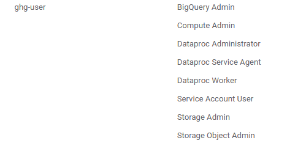

1. Create a project in GCP - `ghg-capstone` 
2. Install Google Cloud SDK.
3. Create service account `ghg-user`. Give the below permissions:

     

   And create a Service Account json key. We'll name it `ghg-creds.json` (**Remember to the name the file the same**)

4. Create SSH key (if you don't have it yet), and add it to GCP. In order to login to the VM.

    (Generate SSH keys to login to VM instances (if you don't have it yet). This will generate an ssh keypair, named gcp and a comment of <username>. The comment (<username>) will be the user on VM :

    In terminal:

    ```bash
    cd ~/.ssh
    ssh-keygen -t rsa -f ~/.ssh/<sshkey_name> -C <username>
    ```

    Copy the generated public key to google cloud: (Compute Engine -> Metadata -> SSH Keys -> Add ssh key) and copy all from file <sshkey_name>.pub. If you already have SSH key to work with your GCP, you can reuse it.)

5. Enable compute engine API, BigQuery API, IAM API, Dataproc API, Cloud Dataproc API, Service Networking API. 
6. Create a vm - `ghg-capstone-vm` with the below specifications:
    - Machine Configs: 
        - instance name: `ghg-capstone-vm`
        - region: `europe-west1 (belgium)`
        - machine type: `e2-standard-4 (4 vCPU, 2 core, 16 GB memory)`
    - OS & Storage:
        - OS: `Ubuntu`
        - version: `Ubuntu 20.04 LTS`
        - size: `30GB`
    - Identity & API access:
        - select `scope`-`allow default access` and `firewall`-`allow https traffic`

7. Create a firewall rule to allow access to Kestra UI at port 8080. 

    

    Click on `Create`

7. Modify/update config file if you already have it setup to add a new Host `ghg-capstone-vm`, like this - 
```
    Host ghg-capstone-vm 
        HostName <external-ip>
        User <username> 
        IdentityFile ~/.ssh/<sshkey_name>
```

13. Add service account keys to VM (locally from local terminal) - It's convenient to make sure your json file is saved in a Home dir location.
For example, create `.gc` in your home dir, add `ghg-creds.json` there...  then `cd` to that folder, do `sftp ghg-capstone-vm` and `mkdir .gc`, `cd .gc` then `put ghg-creds.json`.  

Can also do this - locally. 
```bash
rimsh@LAPTOP-J29FGN6B MINGW64 ~
$ scp ~/.gc/ghg-creds.json rimsha@de-zoomcamp:~/.gc/
ghg-creds.json                                                                            100% 2346    72.6KB/s   00:00
```

**Make sure to put the file in the location ~/.gc/ghg-creds.json**

8. Login to your VM locally by running `ssh ghg-capstone-vm`/ or run Remote-SSH in your vscode. 


9. Clone this repo using http in the VM

10. go to git repo, pull from origin main, 
11. then, chmmod +x setup.sh 
12. run setup.sh bash file... to install all dependencies inside VM>bin/. **Remember to logout then login for some changes to be updated!**

14. Configure gcloud with your service account .json file (Make sure to add the correct path in the .env file)
```bash
rimsha@de-zoomcamp:~/GHG-Emissions-Analytics-Pipeline$ source .env
rimsha@de-zoomcamp:~/GHG-Emissions-Analytics-Pipeline$ export GOOGLE_APPLICATION_CREDENTIALS=$KEY_PATH
rimsha@de-zoomcamp:~/GHG-Emissions-Analytics-Pipeline$ gcloud auth activate-service-account --key-file=$KEY_PATH
Activated service account credentials for: [ghg-user@ghg-capstone.iam.gserviceaccount.com]
```
**done using set_credentials.sh don't have to do again.**

15. Login to your VM via ssh / Remote-SSH 

15. Run `conda init bash`, `source ~/.bashrc`, `conda activate bash` then do `pip intall requirements.txt`

16. go to the terraform dir. 

Run 
terraform init
then 
terraform plan and 
then
`export $(grep -v '^#' $HOME/GHG-Emissions-Analytics-Pipeline/.env | xargs)`  > to export env variables
terraform apply. 


16. Running kestra... modify email and pass in .env to a valid email id and your chosen password to login to kestra UI and run kestra_api commands. 
```
KESTRA_PORT="8080"
VM_IP="external_ip_vm" #TODO
KESTRA_EMAIL="youremail" #TODO
KESTRA_PASSWORD="password" #TODO
NAMESPACE="ghg_project"
```

**Also update gcp_kv accordingly.**


17. Run the sh file to create and execute Kestra flows. 

```bash
chmod +x execute_all_flows.sh 
./execute_all_flows.sh
```


<details>
Command to run the flow 1 - `curl -v -X POST "http://34.78.176.130:8080/api/v1/flows" -H "Content-Type: application/x-yaml" -u "bashirrimsha22@gmail.com:kestra" --data-binary @created-by-api.yml`

Command to execute the flow 1 - `curl -X POST "http://34.78.176.130:8080/api/v1/executions/company.gk/created_by_api"` 


#Note -region, location, project_id defined in env. 

run api command to add key-value pair for `GCP_CREDS`


curl -v -X PUT "http://34.78.176.130:8080/api/v1/namespaces/your_namespace/kv/GCP_CREDS" \
     -H "Content-Type: application/json" \
     -u "bashirrimsha22@gmail.com:kestra" \
     --data-binary @~/.gc/gcp_creds.json

To verify:

curl -X GET "http://34.78.176.130:8080/api/v1/namespaces/your_namespace/kv/GCP_CREDS" \
     -u "bashirrimsha22@gmail.com:kestra"

curl -v POST "http://34.38.225.163:8080/api/v1/flows" \
    -H "Content-Type: application/x-yaml" \
    -u "bashirrimsha22@gmail.com:kestra" \
    --data-binary @gcp_kv.yml

</details>


SPARK

Setup Spark in the VM (In your VM bash)

```bash
cd GHG-Emissions-Analytics-Pipeline/scripts
mkdir lib
gsutil cp gs://hadoop-lib/gcs/gcs-connector-hadoop3-2.2.5.jar ./lib/
```

Now, in your VM cd to kestra chmod +x exec all flows, then ./execallflows. 


DBT setup

```bash 
# for me only.
(base) rimsha@ghg-capstone-vm:~/GHG-Emissions-Analytics-Pipeline$ python -m venv dbt-env
(base) rimsha@ghg-capstone-vm:~/GHG-Emissions-Analytics-Pipeline$ source dbt-env/bin/activate
(dbt-env) (base) rimsha@ghg-capstone-vm:~/GHG-Emissions-Analytics-Pipeline$ pip install dbt-core dbt-bigquery
```

makr sure to edit profiles.yml file as per your VM. (change location, if required.)
run dbt init on your VM/ or dbt debug (profiles.yml)

```yaml
ghg-capstone:
  target: dev
  outputs:
    dev:
      type: bigquery
      method: service-account
      project: ghg-capstone
      dataset: Staging
      threads: 1
      keyfile: "{{ env_var('GCP_KEYFILE') }}"  # Uses an environment variable
      location: EU
      job_execution_timeout_seconds: 300
      job_retries: 1
      priority: interactive
```